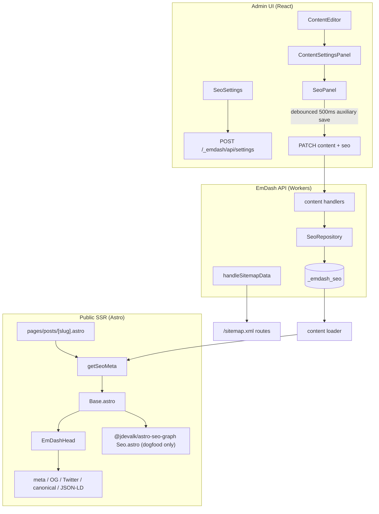

# EmDash SEO — current state

**Audit date:** 2026-07-12 (America/New_York)  
**Auditor environment:** macOS darwin 25.5.0, Node via project tooling, no browser HTML capture in this research run

## Version baseline

| Artifact | Value | Evidence |
|----------|-------|----------|
| EmDash core package | **0.29.0** | `/Users/crobertson/Projects/emdash/packages/core/package.json` |
| EmDash core commit | **c24b7d3be5efa95e7874e48360e31fdc8b27a06d** | `git -C /Users/crobertson/Projects/emdash rev-parse HEAD` |
| Dogfood site (`opensourcetogether`) branch | **feat/xfn-per-link-dogfood** | `git branch --show-current` |
| Dogfood site commit | **ff8cd5ff87d8d8c829d2f13472238cef1b497d9f** | `git rev-parse HEAD` |
| Dogfood `package.json` version | **0.0.1** (site package; not EmDash core) | `opensourcetogether/package.json` |
| Screenshot claim (unverified) | v0.29.0 @ baf4d839 | Treat as screenshot evidence only; does not match checked-out dogfood commit |

**Dirty state (dogfood):** modified `astro.config.mjs`, `package.json`, `package-lock.json`, `src/worker.ts`; untracked `.cursor/`, `scripts/`.

**Dirty state (emdash):** not fully enumerated; research read-only.

### Technology stack

| Layer | Choice |
|-------|--------|
| Framework | Astro (SSR `output: "server"`) |
| Runtime | Cloudflare Workers (dogfood) |
| CMS core | `emdash` monorepo (`/Users/crobertson/Projects/emdash`) |
| Admin UI | React 19, TanStack Router/Query, TipTap PT editor |
| Design system | `@cloudflare/kumo` |
| i18n | Lingui |
| DB | SQLite/D1 via Kysely migrations |
| Package managers | **pnpm** (emdash workspace), **npm** (opensourcetogether site) |
| Tests | Vitest (unit/integration), Playwright (e2e, admin browser) |

## Architecture diagram

## Existing SEO surface (observed)

### Per-item editor (`SeoPanel`)

**Source:** `/Users/crobertson/Projects/emdash/packages/admin/src/components/SeoPanel.tsx`

| Control | Stored field | Notes |
|---------|--------------|-------|
| OG / SEO image | `seo.image` | via `SeoImageField` |
| SEO title | `seo.title` | debounced 500ms |
| Meta description | `seo.description` | shows `n/160` hint |
| Canonical URL | `seo.canonical` | free text |
| Hide from search engines | `seo.noIndex` | sets `noindex, nofollow` in public output |

**Inference:** No focus keyphrase, no analysis results, no SERP preview, no social title/description overrides, no schema controls, no robots granularity (nofollow/advanced).

### Site SEO settings (`SeoSettings`)

**Source:** `/Users/crobertson/Projects/emdash/packages/admin/src/components/settings/SeoSettings.tsx`

| Control | Setting key |
|---------|-------------|
| Title separator | `seo.titleSeparator` |
| Default social image | `seo.defaultOgImage` |
| Google verification | `seo.googleVerification` |
| Bing verification | `seo.bingVerification` |
| robots.txt body | `seo.robotsTxt` |

### Content Analysis screen (screenshot vs repository)

**Observed behavior:** User screenshots reference a separate “Content Analysis” screen with focus keyphrase + Analyze + Flesch copy.

**Repository verification:** No `ContentAnalysis` route/component/strings (Flesch, focus keyphrase analysis UI) in `emdash@0.29.0` admin source. Closest existing pieces:

- `DocumentOutline` (heading navigation)
- Editor footer word/character/reading-time metrics
- WP import CLI `ContentAnalysis` type (WXR inventory only — not product UI)

**Recommendation:** Treat screenshot as **target UX intent** or unreleased branch, not current shipped behavior.

## Data model trace (SEO title example)

| Step | Location |
|------|----------|
| 1. Editor input | `SeoPanel` local draft → `onChange` → `ContentSeoInput.title` |
| 2. Client state | Router `updateMutation` `changes: { seo }`, `source: "auxiliary"` |
| 3. API | Content update handler validates `contentSeoInput` (Zod: title max 200) |
| 4. Validation | API schema + `SeoRepository.upsert` COALESCE merge |
| 5. Database | `_emdash_seo.seo_title` keyed by `(collection, content_id)` |
| 6. Public load | Loader folds row → `entry.data.seo` |
| 7. Template | `getSeoMeta()` prefers `seo.title` over `data.title` |
| 8. HTML head | `EmDashHead` → `generateBaseSeoContributions` → `<title>` via page layout + meta description property |
| 9. Reload editor | `fetchContent` hydrates `seo` → `SeoPanel` syncs from props |

**Migration:** `018_seo.ts` creates `_emdash_seo` and `has_seo` on collections.

## Public metadata generation

**Primary path (source-backed):** `getSeoMeta` + `EmDashHead` + `resolvePageMetadata` (plugin → site → base, first-wins).

**Dogfood complication (observed):** `opensourcetogether/src/layouts/Base.astro` renders **both** `@jdevalk/astro-seo-graph/Seo.astro` and `<EmDashHead>`. **Inference:** Risk of duplicate `title`, `description`, and OG tags unless carefully deduplicated.

**Source-backed fact:** `EmDashHead.astro` emits SSR metadata including JSON-LD (`packages/core/tests/repro/emdash-head.render.test.ts`).

## Sitemaps, robots, RSS, schema

| Output | Status | Path |
|--------|--------|------|
| `/sitemap.xml` | Implemented | `packages/core/src/astro/routes/sitemap*.ts` |
| `/robots.txt` | Implemented | `packages/core/src/astro/routes/robots.txt.ts` |
| JSON-LD | Partial (BlogPosting / WebSite) | `packages/core/src/page/jsonld.ts` |
| hreflang | Implemented | `packages/core/src/seo/hreflang.ts` |
| RSS | Site-level (dogfood) | `opensourcetogether/src/pages/rss.xml.ts` |

Sitemap includes only collections with `has_seo = 1`, published, not `seo_no_index`.

## Permissions

| Action | Permission | Min role |
|--------|------------|----------|
| Site SEO settings | `settings:manage` | ADMIN |
| Per-item SEO fields | content edit permissions | AUTHOR+ (own) / EDITOR (any) |

No dedicated `seo:*` capabilities.

## HTML sanitization (metadata)

- `escapeHtmlAttr` for meta attributes (`page/metadata.ts`)
- `safeJsonLdSerialize` for JSON-LD
- `sanitizeHref` for links
- **Gap:** No Portable Text → analysis text normalizer

## Tests (existing)

- `packages/core/tests/unit/seo/get-seo-meta.test.ts`
- `packages/core/tests/integration/seo/seo.test.ts`
- `packages/admin/tests/components/SeoPanel.test.tsx`
- Sitemap, hreflang, EmDashHead render tests

**Gap:** No end-to-end public HTML metadata regression suite on dogfood.

## Design system hooks for future SEO UI

- Kumo: `Input`, `InputArea`, `Switch`, `Button`, `Collapsible`, toasts
- Patterns: `FieldHelpLabel`, `EditorHeader`, sidebar/sheet (`ContentEditor`)
- Accessibility: Lingui strings, `aria-label` on SeoPanel controls

## Rollback / feature flags

- Migrations are forward-only via numbered Kysely migrations; SEO migration `018_seo`
- No SEO-specific feature flag package; plugin hooks `page:metadata` for extensions

## Karpathy and Loop Engineering rules applied to this project

| Principle | Source path | Workflow change | Enforced by |
|-----------|-------------|-----------------|-------------|
| Think before coding | `/Users/crobertson/no-icloud/2nd Brain/1. Projects/llm-wiki-knowledge-hub/CUSTOM_INSTRUCTIONS.md` | This research run completes before implementation; assumptions flagged explicitly | Implementation gate in handoff doc |
| Simplicity first | Same + `/Users/crobertson/no-icloud/2nd Brain/1. Projects/Coding Project Kickoff Playbook.md` | Vertical slices; no Yoast UI clone; minimum schema expansion | ADR + slice exclusions |
| Surgical changes | `CUSTOM_INSTRUCTIONS.md` §3 | Grok agents own disjoint file sets; Fable 5 reconciles | Handoff file ownership map |
| Goal-driven execution | `CUSTOM_INSTRUCTIONS.md` §4 | Each slice has acceptance tests before merge | Implementation plan DoD |
| Verify before done | `/Users/crobertson/no-icloud/2nd Brain/1. Projects/llm-wiki-pkm-productivity/wiki/concepts/Loop Engineering.md` | Checker re-derives from tests/HTML, not agent draft | Public HTML fixture tests in slice 1 |
| Maker/checker split | `Loop Engineering.md` | Fable 5 orchestrates; Grok implements; verification sub-agent runs tests | Handoff prompt structure |
| Deterministic checks | `Loop Engineering.md` (flaky-check note) | Parity fixtures pinned to Yoast 28.0 / yoastseo 3.6.0 | `docs/plans` fixture versioning |
| Route judgment to expensive model | `Loop Engineering.md` §cost routing | Fable 5 architecture; Grok bounded slices | Handoff orchestration |
| Prepare ≠ ship | `Coding Project Kickoff Playbook.md` | Research artifacts only; stop at slice 1 unless approved | User approval gate |

## Open uncertainties

1. Content Analysis screen origin (branch/mock vs planned).
2. Whether dogfood intentionally dual-stacks `astro-seo-graph`.
3. WP import maps `_yoast_wpseo_focuskw` → `seo.keywords` but `_emdash_seo` has no keywords column (data loss risk).
